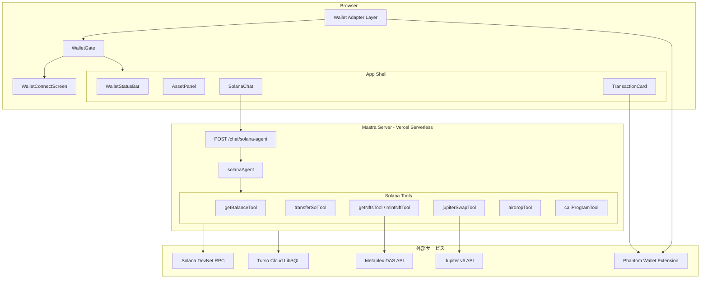
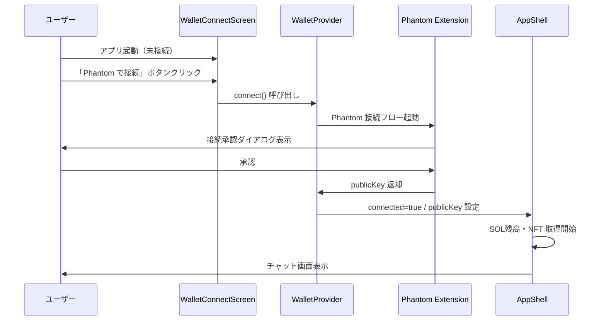
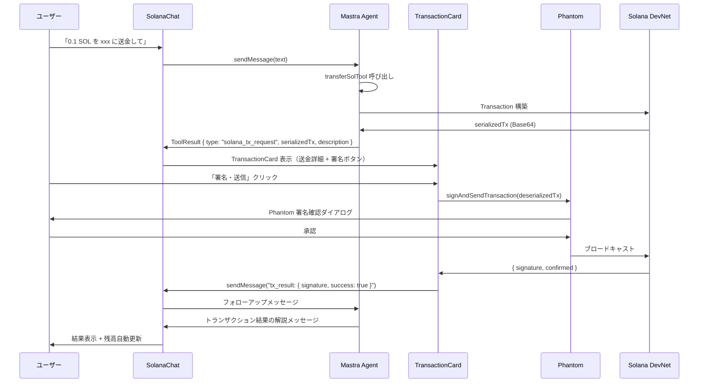
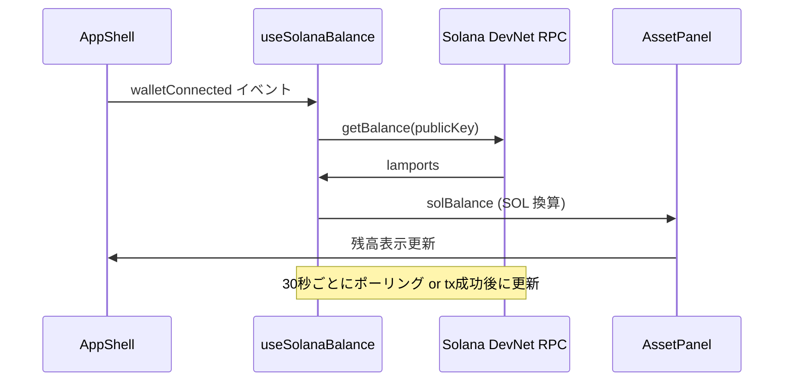

# 技術設計書 — Solana Mastra AI Agent アプリ

---

## Overview

本機能は、Solana Superteam Japan 主催の BootCamp 向けに、自然言語で Solana ブロックチェーン操作が行えるチャット型 AI Agent アプリを提供する。ユーザーは Phantom ウォレット（またはソーシャルログイン）で接続後、Mastra Agent と会話するだけで、SOL 送金・NFT 操作・DeFi スワップ・スマートコントラクト呼び出しのトランザクションを構築・実行できる。すべてのトランザクション署名はユーザーの意志に基づき Phantom SDK を通じて行われ、AI Agent が代わりに署名することはない。

**Purpose**: Solana の複雑なブロックチェーン操作を自然言語でアクセシブルにし、BootCamp 聴衆にインパクトのあるデモ体験を提供する。

**Users**: Solana DevNet 上の一般ユーザーおよび BootCamp 参加者が、Phantom ウォレット接続後にチャット形式で Solana 操作を行う。

**Impact**: 既存の `mastra-react` テンプレート（weatherAgent ベース）を Solana Agent アーキテクチャへ移行し、ウォレット統合・トランザクション署名フロー・Solana ブランドテーマを新規追加する。

### Goals

- Phantom Connect による安全なウォレット接続とセッション管理
- 自然言語によるブロックチェーン操作（送金・NFT・DeFi・スマートコントラクト）
- ユーザー主導のトランザクション署名フロー（Agent 非署名の保証）
- Solana ブランドカラー + Apple HIG に準拠した独自デザイン
- Vercel Serverless へのデプロイ可能な構成

### Non-Goals

- Solana Mainnet での運用（DevNet 専用）
- Privy ソーシャルログインの Phase 1 実装（Phase 2 以降）
- マルチウォレット同時管理
- カスタム Solana Program のオンチェーンデプロイ

---

## Requirements Traceability

| 要件 | 概要 | コンポーネント | インターフェース | フロー |
|---|---|---|---|---|
| 1.1–1.7 | ウォレット接続・認証 | WalletProvider, WalletGate, WalletConnectScreen, WalletStatusBar | WalletService | ウォレット接続フロー |
| 2.1–2.7 | チャット UI / Agent 連携 | SolanaChat, ChatMessageList | ChatService | チャット送受信フロー |
| 3.1–3.6 | 残高・NFT 表示 | AssetPanel, NFTGrid | AssetService | 残高取得フロー |
| 4.1–4.8 | トランザクション構築・署名 | TransactionCard, TransactionResult | TransactionService | トランザクション署名フロー |
| 5.1–5.8 | Mastra Agent ツール群 | solanaAgent, solana tools | ToolContracts | Agent ツール実行フロー |
| 6.1–6.6 | デザイン / UI/UX | SolanaTheme (CSS), 全 UI コンポーネント | — | — |
| 7.1–7.4 | DevNet 設定 | SolanaProvider, 全 tools | NetworkConfig | — |
| 8.1–8.5 | デプロイ / パフォーマンス | Mastra config (VercelDeployer) | DeployConfig | — |

---

## Architecture

### 既存アーキテクチャ分析

`mastra-react/` は Vite + React + Mastra のフルスタックテンプレートであり、以下の既存資産を継承する:

- `@ai-sdk/react` の `useChat` + `DefaultChatTransport` — エージェント通信基盤として保持
- `components/ai-elements/` — Conversation, Message, PromptInput, Tool, Confirmation コンポーネント群を再利用
- `components/ui/` — Shadcn UI コンポーネント群（Button, Card, Dialog, Badge, Avatar 等）
- `src/mastra/index.ts` の Mastra インスタンス設定 — chatRoute, Storage, Observability を保持（StorageURL は変更）
- `biome.json`, `bun.lockb` — ツールチェーンはそのまま使用

### Architecture Pattern & Boundary Map

**採用パターン**: Layered Architecture（4 層）+ Provider パターン（ウォレット状態管理）



**アーキテクチャの決定事項**:

- **WalletGate パターン**: `WalletProvider` → `WalletGate` → `[WalletConnectScreen | AppShell]` の条件分岐でウォレット接続状態を全体で管理
- **トランザクションコールバック**: ツールが `SolanaTxRequest` 型を返却 → Frontend が検出して TransactionCard 表示 → 署名後 useChat でフォローアップメッセージ送信（詳細は `research.md` Decision 2）
- **Vercel StorageURL**: 開発時は `file:` URL、本番は `MASTRA_LIBSQL_URL` 環境変数（詳細は `research.md` Decision 3）

### Technology Stack

| レイヤー | 選択 / バージョン | 役割 | 備考 |
|---|---|---|---|
| Frontend | React 19 + Vite 8 + TypeScript 6 | SPA フロントエンド | 既存 |
| Wallet | `@solana/wallet-adapter-react` + `@solana/wallet-adapter-phantom` | Phantom Connect 統合 | 新規追加 |
| Blockchain Client | `@solana/web3.js` | RPC 通信・残高取得・tx 構築 | 新規追加 |
| NFT | `@metaplex-foundation/umi` + `@metaplex-foundation/digital-asset-standard-api` | NFT 取得 (DAS API) | 新規追加 |
| DeFi | Jupiter v6 REST API (fetch) | スワップ tx 構築 | SDK 不要、直接 REST |
| AI / Agent | Mastra 1.5 + `@mastra/core` + `@ai-sdk/react` | エージェント基盤 | 既存 (エージェント差替) |
| Agent Deploy | `@mastra/deployer-vercel` | Vercel Serverless デプロイ | 新規追加 |
| Storage | LibSQL (dev: `file:`, prod: Turso Cloud) | Mastra メモリ・履歴 | URL 変更 |
| Styling | Tailwind CSS 4 + Shadcn UI + motion | Solana テーマ UI | 既存 + CSS 変数更新 |
| Toolchain | bun + biome | パッケージ管理・Lint | 既存 |

---

## System Flows

### ウォレット接続フロー



### トランザクション署名フロー



### 残高取得フロー



---

## Components and Interfaces

### コンポーネント一覧

| コンポーネント | ドメイン / レイヤー | 概要 | 要件カバレッジ | 主要依存 (P0/P1) | コントラクト |
|---|---|---|---|---|---|
| WalletProvider | Wallet / State | Solana Provider 3 層ラッパー | 1.1–1.7 | @solana/wallet-adapter-react (P0) | State |
| WalletGate | Wallet / Presentation | 接続状態による画面分岐 | 1.1, 1.6 | WalletProvider (P0) | — |
| WalletConnectScreen | Wallet / Presentation | 未接続時の接続 UI | 1.1–1.3 | WalletProvider (P0) | — |
| WalletStatusBar | Wallet / Presentation | ヘッダー：アドレス・ネットワーク表示 | 1.4, 7.2 | useWallet, useSolanaBalance (P0) | — |
| AssetPanel | Asset / Presentation | SOL残高 + NFT 一覧パネル | 3.1–3.6 | useSolanaBalance (P0), useNFTs (P1) | — |
| NFTGrid | Asset / Presentation | NFT サムネイルグリッド | 3.4, 3.5 | AssetPanel (P0) | — |
| SolanaChat | Chat / Application | メインチャット画面（App.tsx 置換） | 2.1–2.7 | useChat, WalletProvider (P0) | State |
| TransactionCard | Transaction / Presentation | チャット内署名 UI | 4.2–4.5 | useWallet (P0), Phantom SDK (P0) | State |
| TransactionResult | Transaction / Presentation | 署名後結果表示 | 4.6–4.8 | TransactionCard (P0) | — |
| useSolanaBalance | Hook / State | SOL 残高取得・ポーリング | 3.1–3.3 | @solana/web3.js Connection (P0) | Service |
| useNFTs | Hook / State | NFT 一覧取得 | 3.4, 3.5 | Metaplex DAS API (P1) | Service |
| solanaAgent | Mastra / Agent | Solana AI エージェント | 5.1–5.8 | Solana tools (P0) | Service |
| getBalanceTool | Mastra / Tool | 残高照会ツール | 5.1 | @solana/web3.js (P0) | Service |
| transferSolTool | Mastra / Tool | SOL 送金 tx 構築ツール | 5.2 | @solana/web3.js (P0) | Service |
| getNftsTool | Mastra / Tool | NFT 一覧取得ツール | 5.3 (partial) | Metaplex DAS (P1) | Service |
| mintNftTool | Mastra / Tool | NFT 発行 tx 構築ツール | 5.3 | @metaplex-foundation/umi (P1) | Service |
| jupiterSwapTool | Mastra / Tool | スワップ tx 構築ツール | 5.4 | Jupiter v6 API (P1) | Service |
| airdropTool | Mastra / Tool | DevNet エアドロップツール | 7.3 | @solana/web3.js (P0) | Service |
| callProgramTool | Mastra / Tool | Program 呼び出し tx 構築ツール | 5.5 | @solana/web3.js (P1) | Service |

---

### Wallet Layer

#### WalletProvider

| フィールド | 詳細 |
|---|---|
| Intent | Solana Provider 3 層（ConnectionProvider → WalletProvider → WalletModalProvider）をラップし、アプリ全体に Wallet コンテキストを提供する |
| Requirements | 1.1, 1.2, 1.3, 1.6, 1.7 |

**Responsibilities & Constraints**
- Solana DevNet RPC URL (`VITE_SOLANA_RPC_URL`) を `ConnectionProvider` に注入する
- `autoConnect: true` で既存セッションを自動復元する
- `WalletProvider` の `wallets` 配列に PhantomWalletAdapter を登録する
- 本コンポーネントは `main.tsx` 内で StrictMode の内側に配置する

**Dependencies**
- External: `@solana/wallet-adapter-react` — Provider コンポーネント群 (P0)
- External: `@solana/wallet-adapter-phantom` — PhantomWalletAdapter (P0)
- External: `@solana/wallet-adapter-react-ui` — WalletModalProvider (P0)

**Contracts**: State [ ✓ ]

##### State Management

```typescript
// WalletProvider がアプリ全体に提供するコンテキスト
// @solana/wallet-adapter-react の useWallet() から取得
interface WalletContextState {
  publicKey: PublicKey | null;
  connected: boolean;
  connecting: boolean;
  disconnect: () => Promise<void>;
  signAndSendTransaction: (transaction: Transaction | VersionedTransaction) => Promise<{ signature: string }>;
  wallet: Wallet | null;
}
```

**Implementation Notes**
- Integration: `main.tsx` の `<StrictMode>` 内で `<WalletProvider>` でラップする
- Validation: DevNet URL の環境変数が未設定の場合は起動時エラーをスローする
- Risks: PhantomWalletAdapter は Phantom 拡張機能がインストールされていない場合は `window.phantom` が未定義となる。WalletModalProvider がその場合でも適切なエラーを表示する

---

#### WalletGate

| フィールド | 詳細 |
|---|---|
| Intent | `useWallet().connected` の状態に基づいて WalletConnectScreen または AppShell を条件レンダリングする |
| Requirements | 1.1, 1.6 |

**Dependencies**
- Inbound: `WalletProvider` — wallet コンテキスト (P0)
- Outbound: `WalletConnectScreen` — 未接続時のレンダリング (P0)
- Outbound: `AppShell` — 接続済み時のレンダリング (P0)

**Contracts**: State [ ✓ ]

##### State Management

```typescript
// Props インターフェース
interface WalletGateProps {
  children: React.ReactNode; // AppShell コンテンツ
}
// 内部状態: useWallet().connected を監視
```

---

### Asset Layer

#### useSolanaBalance

| フィールド | 詳細 |
|---|---|
| Intent | 接続ウォレットの SOL 残高を Solana DevNet RPC から取得し、30 秒間隔でポーリングして最新値を返す |
| Requirements | 3.1, 3.2, 3.3, 4.7 |

**Dependencies**
- External: `@solana/web3.js` Connection.getBalance() (P0)
- Inbound: `useWallet().publicKey` — ウォレットアドレス (P0)
- Inbound: `useConnection().connection` — RPC Connection (P0)

**Contracts**: Service [ ✓ ]

##### Service Interface

```typescript
interface UseSolanaBalanceReturn {
  solBalance: number | null;       // SOL 単位（lamports ÷ 1e9）
  isLoading: boolean;
  error: SolanaError | null;
  refetch: () => Promise<void>;    // 手動更新
}

function useSolanaBalance(): UseSolanaBalanceReturn;
```

- Preconditions: `useWallet().connected === true`
- Postconditions: `solBalance` は小数点 9 桁精度の SOL 値
- Invariants: `publicKey` が変更されたら残高を再取得する

**Implementation Notes**
- Integration: `useEffect` で 30 秒ポーリング、`publicKey` 変更時にリセット
- Validation: `lamports` が負の値の場合は `null` を返す
- Risks: 頻繁なポーリングによるレート制限。QuickNode/Helius 無料枠の RPS 制限に注意

---

#### useNFTs

| フィールド | 詳細 |
|---|---|
| Intent | 接続ウォレットが保有する NFT 一覧を Metaplex DAS API から取得する |
| Requirements | 3.4, 3.5 |

**Dependencies**
- External: `@metaplex-foundation/digital-asset-standard-api` — getAssetsByOwner (P1)
- External: `@metaplex-foundation/umi` — UMI クライアント (P1)
- Inbound: `useWallet().publicKey` (P0)

**Contracts**: Service [ ✓ ]

##### Service Interface

```typescript
interface NFTAsset {
  id: string;            // mint アドレス
  name: string;
  imageUrl: string;
  symbol: string;
}

interface UseNFTsReturn {
  nfts: NFTAsset[];
  isLoading: boolean;
  error: SolanaError | null;
}

function useNFTs(): UseNFTsReturn;
```

**Implementation Notes**
- Integration: DAS API は `VITE_SOLANA_RPC_URL` が DAS 対応エンドポイント（QuickNode/Helius）の場合のみ動作
- Risks: 標準 Solana DevNet RPC は DAS API 非対応。フォールバックとして NFT なし表示を提供

---

### Transaction Layer

#### TransactionCard

| フィールド | 詳細 |
|---|---|
| Intent | Mastra Agent がトランザクション署名依頼を返した際にチャット内に表示される署名 UI。ユーザーがトランザクション詳細を確認し「署名・送信」ボタンで Phantom SDK を呼び出す |
| Requirements | 4.2, 4.3, 4.4, 4.5 |

**Dependencies**
- Inbound: `SolanaChat` — ToolResult からの tx データ (P0)
- Outbound: `useWallet().signAndSendTransaction` — Phantom 署名 API (P0)
- Outbound: `SolanaChat.sendMessage` — 署名結果フォローアップ (P0)
- External: `@solana/web3.js` — Transaction デシリアライズ (P0)

**Contracts**: State [ ✓ ]

##### State Management

```typescript
// ツールが返却する型（discriminated union）
interface SolanaTxRequest {
  type: "solana_tx_request";
  serializedTx: string;        // Base64 エンコードシリアライズ済み tx
  description: string;         // 人間向け説明（"0.1 SOL を xxx に送金"）
  txType: "transfer" | "nft_mint" | "nft_transfer" | "swap" | "program_call" | "airdrop";
}

// コンポーネント Props
interface TransactionCardProps {
  txRequest: SolanaTxRequest;
  onSign: (result: TransactionSignResult) => void;
  onCancel: () => void;
}

// 署名結果
type TransactionSignResult =
  | { success: true; signature: string }
  | { success: false; error: string };
```

**Implementation Notes**
- Integration: `ToolOutput` コンポーネント内で `txRequest.type === "solana_tx_request"` を検出してレンダリング切り替え
- Validation: `serializedTx` が無効な Base64 の場合はエラー表示してキャンセル扱いにする
- Risks: Phantom 拡張機能がロックされている場合、signAndSendTransaction がエラーを返す。ユーザーに Phantom アンロックを促すメッセージを表示する

---

### Mastra Agent Layer

#### solanaAgent

| フィールド | 詳細 |
|---|---|
| Intent | ユーザーの自然言語メッセージを解釈し、適切な Solana ツールを呼び出してトランザクション構築・情報取得・結果解説を行う Mastra Agent |
| Requirements | 5.1–5.8, 2.7 |

**Dependencies**
- Inbound: `chatRoute` POST `/chat/solana-agent` (P0)
- Outbound: `getBalanceTool`, `transferSolTool`, `getNftsTool`, `mintNftTool`, `jupiterSwapTool`, `airdropTool`, `callProgramTool` (P0)
- External: Google Gemini または Anthropic Claude (P0) — LLM バックエンド

**Contracts**: Service [ ✓ ]

##### Service Interface

```typescript
// Mastra Agent 定義（設計レベル）
interface SolanaAgentConfig {
  id: "solana-agent";
  name: string;
  instructions: string;   // 詳細な System Prompt（日本語・英語混在）
  model: string;          // e.g. "anthropic/claude-sonnet-4-6" 
  tools: SolanaToolSet;
  memory: Memory;
}

interface SolanaToolSet {
  getBalanceTool: Tool<GetBalanceInput, GetBalanceOutput>;
  transferSolTool: Tool<TransferSolInput, SolanaTxRequest>;
  getNftsTool: Tool<GetNftsInput, GetNftsOutput>;
  mintNftTool: Tool<MintNftInput, SolanaTxRequest>;
  jupiterSwapTool: Tool<JupiterSwapInput, SolanaTxRequest>;
  airdropTool: Tool<AirdropInput, AirdropOutput>;
  callProgramTool: Tool<CallProgramInput, SolanaTxRequest>;
}
```

**Implementation Notes**
- Integration: `src/mastra/index.ts` の `agents` に登録し、`chatRoute` の `:agentId` を `solana-agent` に変更
- Validation: Agent instructions に「絶対にトランザクションに署名しない」旨を明示
- Risks: LLM がトランザクション詳細を誤生成するリスク → ツール側で入力値を Zod スキーマで厳密にバリデートする

---

#### Solana ツール群（共通コントラクト）

すべての Solana ツールは `createTool()` で定義し、以下の共通型を継承する:

```typescript
// tx を構築するツールの共通出力型
interface SolanaTxRequest {
  type: "solana_tx_request";
  serializedTx: string;
  description: string;
  txType: "transfer" | "nft_mint" | "nft_transfer" | "swap" | "program_call" | "airdrop";
}

// 情報取得ツールの共通エラー型
type SolanaError =
  | { code: "INVALID_ADDRESS"; message: string }
  | { code: "RPC_ERROR"; message: string }
  | { code: "INSUFFICIENT_BALANCE"; message: string }
  | { code: "RATE_LIMITED"; message: string }
  | { code: "NETWORK_MISMATCH"; message: string };
```

**各ツールの入出力スキーマ**:

```typescript
// getBalanceTool
interface GetBalanceInput {
  address: string;  // Solana public key (base58)
}
interface GetBalanceOutput {
  address: string;
  lamports: number;
  sol: number;
  network: "devnet";
}

// transferSolTool
interface TransferSolInput {
  fromAddress: string;   // 送金元（接続ウォレット）
  toAddress: string;     // 送金先 public key
  amountSol: number;     // SOL 単位
}
// returns SolanaTxRequest

// getNftsTool
interface GetNftsInput {
  ownerAddress: string;
  limit?: number;      // default: 20
  page?: number;       // default: 1
}
interface GetNftsOutput {
  items: NFTAsset[];
  total: number;
}

// mintNftTool
interface MintNftInput {
  ownerAddress: string;
  name: string;
  symbol: string;
  uri: string;          // metadata JSON URI
  sellerFeeBasisPoints: number;
}
// returns SolanaTxRequest

// jupiterSwapTool
interface JupiterSwapInput {
  inputMint: string;    // トークン mint アドレス
  outputMint: string;
  amountLamports: number;
  slippageBps: number;  // default: 50 (0.5%)
  userPublicKey: string;
}
// returns SolanaTxRequest

// airdropTool
interface AirdropInput {
  address: string;
  amountSol: number;    // DevNet のみ、max 2 SOL
}
interface AirdropOutput {
  signature: string;
  amountSol: number;
}

// callProgramTool
interface CallProgramInput {
  programId: string;
  instructionData: string;  // Base64
  accounts: Array<{ pubkey: string; isSigner: boolean; isWritable: boolean }>;
  fromAddress: string;
}
// returns SolanaTxRequest
```

---

### Chat Layer

#### SolanaChat

| フィールド | 詳細 |
|---|---|
| Intent | メインのチャット UI コンポーネント。既存 App.tsx を置き換え、solana-agent エンドポイントへの接続・ToolOutput の TransactionCard 検出・署名後フォローアップメッセージ送信を担う |
| Requirements | 2.1–2.7, 4.1–4.8 |

**Contracts**: State [ ✓ ]

##### State Management

```typescript
interface SolanaChatState {
  input: string;
  pendingTxRequest: SolanaTxRequest | null;  // 署名待ちトランザクション
}

// useChat の transport エンドポイント
const transport = new DefaultChatTransport({
  api: "/api/chat/solana-agent",  // Vercel 向けパス
});
```

**Implementation Notes**
- Integration: `messages[].parts` を走査し `part.type === "tool-result"` かつ `output.type === "solana_tx_request"` の場合 TransactionCard をレンダリング
- Validation: ウォレット未接続時に sendMessage が呼ばれた場合はエラーをチャット内表示
- Risks: Mastra Agent が長時間処理する場合の UX → streaming レスポンスで逐次表示（useChat のデフォルト動作を活用）

---

## Data Models

### Domain Model

```
WalletSession
  + publicKey: PublicKey        // ウォレットアドレス
  + network: "devnet"           // 固定
  + connected: boolean

SOLBalance
  + address: PublicKey
  + lamports: number
  + sol: number                 // lamports / 1e9
  + timestamp: Date             // 取得時刻

NFTAsset
  + id: string                  // mint アドレス
  + name: string
  + imageUrl: string
  + ownerAddress: PublicKey

SolanaTxRequest
  + type: "solana_tx_request"   // discriminant
  + serializedTx: string        // Base64 シリアライズ済み
  + description: string
  + txType: TxType

TransactionRecord
  + signature: string           // tx ハッシュ
  + success: boolean
  + timestamp: Date
```

### Data Contracts & Integration

**Agent ↔ Frontend のトランザクション型契約**

Mastra ツールの返却値に `type: "solana_tx_request"` の discriminated union を使用する。Frontend はこの `type` フィールドを検出して TransactionCard のレンダリングを決定する。この型は `src/types/solana.ts` に一元定義し、Frontend と Backend (Mastra tools) の両方からインポートする。

**環境変数コントラクト**

| 変数名 | 用途 | 必須 |
|---|---|---|
| `VITE_SOLANA_RPC_URL` | Solana DevNet RPC URL（DAS API 対応）| ✓ |
| `VITE_SOLANA_NETWORK` | `devnet` 固定 | ✓ |
| `MASTRA_LIBSQL_URL` | Turso Cloud URL（本番）| 本番のみ |
| `MASTRA_LIBSQL_AUTH_TOKEN` | Turso 認証トークン | 本番のみ |
| `ANTHROPIC_API_KEY` または `GOOGLE_GENERATIVE_AI_API_KEY` | LLM API キー | ✓ |

---

## Error Handling

### Error Strategy

各レイヤーで発生したエラーをユーザーが理解できる日本語メッセージとして表示する。システムエラーはコンソールログに記録し、Mastra Observability に転送する。

### Error Categories and Responses

**ウォレットエラー（User/System）**
- 接続拒否: 「接続がキャンセルされました。再度接続ボタンをクリックしてください。」
- ネットワーク不一致: 「Phantom の設定を DevNet に切り替えてください。」
- 署名拒否: TransactionCard にキャンセルメッセージを表示し、チャットに「署名がキャンセルされました」を追加

**RPC エラー（System）**
- 接続タイムアウト: 「Solana ネットワークに接続できません。しばらくしてから再試行してください。」
- レート制限: `useSolanaBalance` の再試行間隔を指数バックオフで延長

**Agent エラー（System）**
- タイムアウト: チャット内に「エージェントの応答がタイムアウトしました」を表示し、再送信ボタンを提供
- Tool 実行エラー: Mastra が error メッセージをストリーミング返却 → SolanaChat が表示

**トランザクションエラー（System/Business）**
- 残高不足: Agent が `INSUFFICIENT_BALANCE` を検出し自然言語で説明
- tx 失敗: TransactionResult にエラーメッセージ + Solana Explorer リンクを表示

### Monitoring

- Mastra Observability（`DefaultExporter`）で全ツール呼び出しをトレース記録
- Vercel 本番では `CloudExporter` のみ使用（DuckDB 非対応のため）
- ブラウザコンソールに `[SolanaChat]`, `[WalletAdapter]` プレフィックス付きのエラーログを出力

---

## Testing Strategy

### Unit Tests

- `useSolanaBalance`: getBalance のモック RPC レスポンス検証
- `useNFTs`: DAS API のモックレスポンス + NFTAsset マッピング検証
- `transferSolTool`: 入力スキーマバリデーション + シリアライズトランザクション形式検証
- `jupiterSwapTool`: Jupiter API モック + SolanaTxRequest 返却形式検証
- `SolanaTxRequest` 型ガード関数のテスト

### Integration Tests

- `WalletGate`: connected=false → ConnectScreen 表示 / connected=true → AppShell 表示
- `SolanaChat` → `solanaAgent` エンドポイント: メッセージ送信 → レスポンス受信フロー
- `TransactionCard`: `solana_tx_request` ToolResult 検出 → 署名ボタン表示 → Phantom モック署名 → フォローアップメッセージ送信

### E2E/UI Tests

- DevNet ウォレット接続 → SOL 残高表示 → 残高正常値確認
- 「残高を教えて」メッセージ → Agent 応答 → 残高表示確認
- 「テストアドレスに 0.001 SOL 送金して」→ TransactionCard 表示 → 署名フロー（DevNet）

### Performance/Load

- 初回ページロード 3 秒以内（Vercel Edge Network）
- useSolanaBalance のポーリング：RPC 応答 500ms 以内
- Mastra Agent 最初のトークン TTL：2 秒以内（streaming）

---

## Security Considerations

- **非署名保証**: `solanaAgent` の instructions に「絶対にユーザーに代わってトランザクションに署名しない」を明示。Agent がトランザクション送信を行うツールを持たないことでアーキテクチャレベルで保証する
- **秘密鍵の不保持**: Frontend/Backend いずれも秘密鍵を保持しない。署名は Phantom 拡張機能内で完結する
- **環境変数**: API キーは `.env` に格納し、`VITE_` プレフィックスなしの変数はフロントエンドに露出しない（Mastra サーバーサイドのみで使用）
- **入力検証**: すべての Mastra ツールの入力を Zod スキーマで検証し、不正アドレスやオーバーフロー値を拒否する
- **RPC URL**: `VITE_SOLANA_RPC_URL` は信頼できるプロバイダー（QuickNode/Helius）を使用。ユーザー入力による上書きは許可しない

---

## Performance & Scalability

- **Solana RPC ポーリング**: 30 秒間隔に設定し、ユーザーが手動更新ボタンを使用できるようにする
- **NFT キャッシュ**: `useNFTs` は接続時に 1 回取得し、tx 成功後に再取得。不要なポーリングは行わない
- **Vercel Edge**: `mastra build` + `@mastra/deployer-vercel` で関数の `maxDuration` を 60 秒に設定（LLM の長時間応答に対応）
- **Streaming**: `useChat` のデフォルトストリーミングを活用し、Agent 応答の初期表示を高速化

---

## Supporting References

詳細な調査ログ・設計決定の根拠は `research.md` を参照。

| 参照 | 目的 |
|---|---|
| `research.md` Decision 2 | トランザクションコールバックパターンの選定根拠 |
| `research.md` Decision 3 | Vercel ストレージ選定（LibSQL → Turso）根拠 |
| `research.md` トピック 4 | Metaplex DAS API の DevNet 対応 RPC 要件 |
