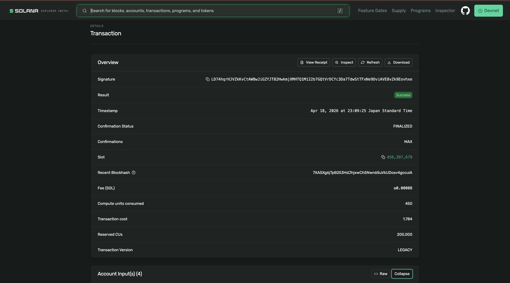
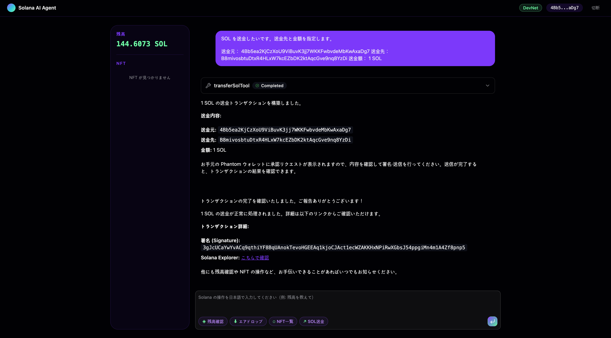
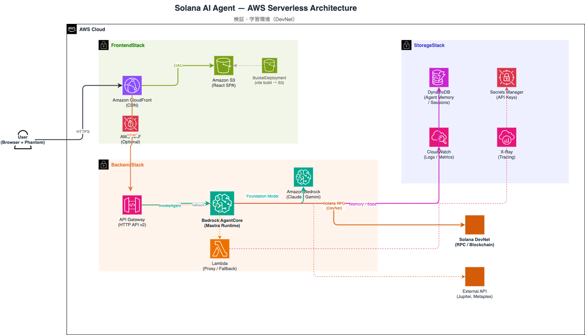
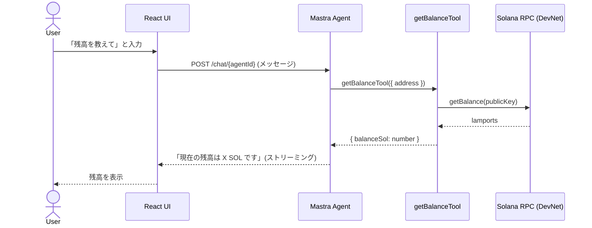
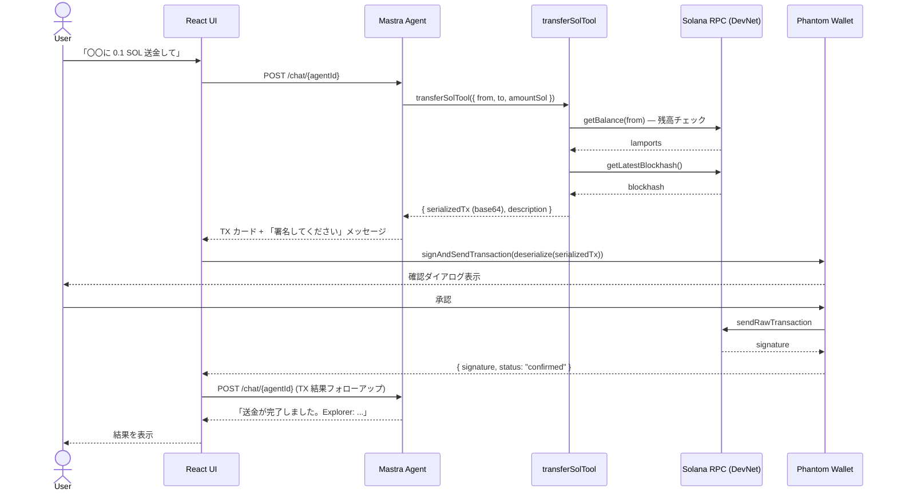
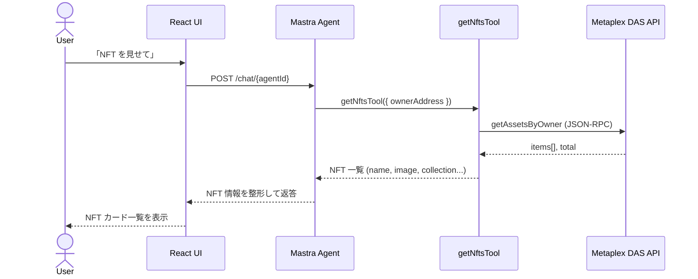
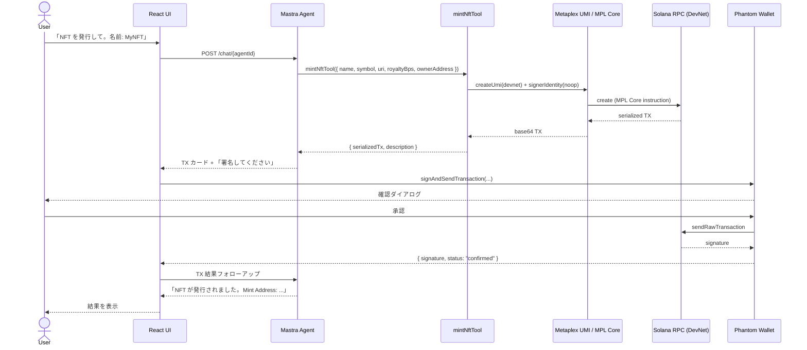
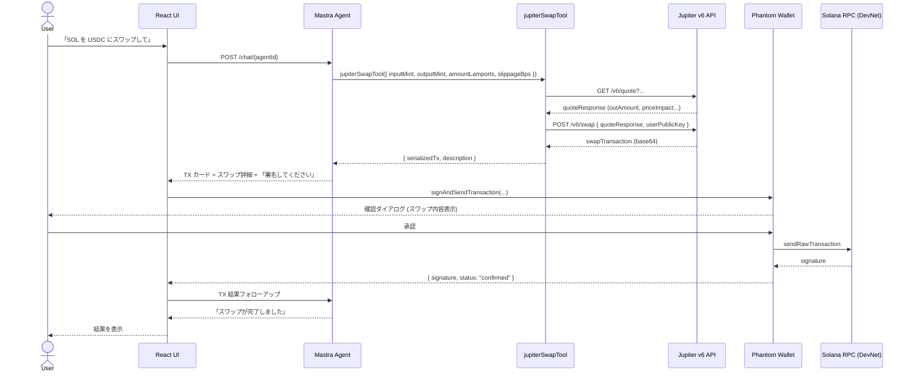
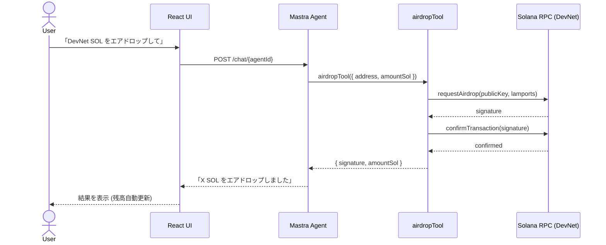
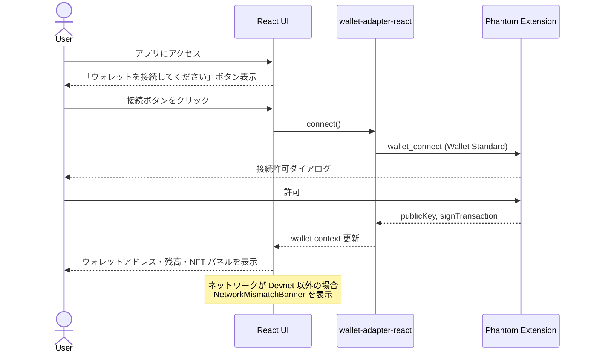

# solana-agent-repo

自然言語で Solana DevNet 上の操作（SOL 送金・NFT 発行・DeFi スワップ・スマートコントラクト呼び出し）ができるチャット UI。  


React + Mastra + TypeScript + Phantom Wallet + Solana を組み合わせた、署名をユーザー委任する設計のリファレンス実装です。

---

## 概要

このリポジトリは **AI Agent × Solana ブロックチェーン** の実践デモです。  

チャット画面でユーザーが自然言語を入力すると、バックエンドの Mastra AI Agent がインテントを解釈して適切な Solana ツール（`transferSolTool` / `mintNftTool` / `jupiterSwapTool` など）を呼び出し、**署名済みトランザクション**ではなく**未署名のシリアライズ済みトランザクション**をフロントエンドへ返します。ユーザーは Phantom Wallet で内容を確認・署名・送信し、その結果を再度 Agent に渡すことで実行結果の解説を受け取ります。

### 設計上の重要な原則

- **AI Agent は署名しない** 
  — トランザクションデータの構築までを担当し、署名はユーザーの Phantom Wallet が行う
- **Devnet 専用** 
  — 本番ネットワーク（Mainnet）への操作は行わない(Jupiterのツールを除く)
- **日本語応答** 
  — すべての Agent 応答は日本語で行われる

### スクリーンショット






### システム構成図



---

## 機能一覧

| # | 機能名 | 説明 | Agent ツール | 署名 |
|---|--------|------|-------------|------|
| 1 | **SOL 残高照会** | ウォレットアドレスの SOL 残高を取得して表示 | `getBalanceTool` | 不要 |
| 2 | **SOL 送金** | 指定アドレスへの SOL 送金トランザクションを構築 | `transferSolTool` | Phantom で署名 |
| 3 | **NFT 一覧取得** | ウォレットが保有する NFT を Metaplex DAS API で取得 | `getNftsTool` | 不要 |
| 4 | **NFT 発行（Mint）** | Metaplex MPL Core で NFT 発行トランザクションを構築 | `mintNftTool` | Phantom で署名 |
| 5 | **トークンスワップ** | Jupiter v6 経由で SPL トークンのスワップ TX を構築 | `jupiterSwapTool` | Phantom で署名 |
| 6 | **DevNet エアドロップ** | DevNet 限定で SOL をエアドロップ（最大 2 SOL / リクエスト） | `airdropTool` | 不要 |
| 7 | **スマートコントラクト呼び出し** | 汎用的な Solana Program 呼び出し TX を構築 | `callProgramTool` | Phantom で署名 |
| 8 | **ウォレット接続** | Phantom Wallet の接続・切断・ネットワーク確認 | wallet-adapter | — |
| 9 | **トランザクション結果解説** | 署名・送信後の成功/失敗をわかりやすく解説 | Agent フォローアップ | — |
| 10 | **資産パネル** | SOL 残高・保有 NFT をサイドパネルに常時表示 | hooks (UI) | — |

---

## 機能ごとの処理シーケンス図

### 1. SOL 残高照会



---

### 2. SOL 送金



---

### 3. NFT 一覧取得



---

### 4. NFT 発行（Mint）



---

### 5. トークンスワップ（Jupiter v6）



---

### 6. DevNet エアドロップ



---

### 7. ウォレット接続フロー



---

## 技術スタック

### フロントエンド

| カテゴリ | ライブラリ / ツール | バージョン | 用途 |
|----------|---------------------|-----------|------|
| UI フレームワーク | React | 19.x | コンポーネントベース UI |
| 言語 | TypeScript | 6.x | 型安全な開発 |
| ビルドツール | Vite | 8.x | 高速 HMR・バンドル |
| スタイリング | Tailwind CSS | 4.x | ユーティリティ CSS |
| コンポーネント | shadcn/ui + Radix UI | latest | アクセシブルな UI 部品 |
| アニメーション | motion/react | 12.x | 画面遷移・マイクロインタラクション |
| アイコン | HugeIcons, Lucide React | latest | UI アイコン |
| Markdown | streamdown | 2.x | AI レスポンスのリッチ表示 |

### AI / エージェント基盤

| カテゴリ | ライブラリ / ツール | バージョン | 用途 |
|----------|---------------------|-----------|------|
| Agent フレームワーク | Mastra | 1.x | Agent・Tool・Workflow 管理 |
| AI SDK | Vercel AI SDK (`ai`) | 6.x | ストリーミングチャット UI |
| LLM | Google Gemini (`@ai-sdk/google`) | latest | Agent のモデルバックエンド |
| メモリ | @mastra/memory + LibSQL | 1.x | 会話履歴の永続化 |
| 観測性 | @mastra/observability + DuckDB | 1.x | Agent ログ・メトリクス |
| デプロイアダプター | @mastra/deployer-vercel | 1.x | Vercel へのデプロイ |

### Solana / Web3

| カテゴリ | ライブラリ / ツール | バージョン | 用途 |
|----------|---------------------|-----------|------|
| Solana クライアント | @solana/web3.js | 1.x | TX 構築・RPC 通信 |
| ウォレットアダプター | @solana/wallet-adapter-react | 0.15.x | マルチウォレット対応 |
| Phantom アダプター | @solana/wallet-adapter-phantom | 0.9.x | Phantom 接続 |
| NFT 標準 | @metaplex-foundation/mpl-core | 1.x | MPL Core NFT 発行 |
| UMI | @metaplex-foundation/umi | 1.x | Metaplex UMI フレームワーク |
| DAS API | @metaplex-foundation/digital-asset-standard-api | 2.x | NFT 一覧取得 |
| DeFi ルーティング | Jupiter v6 API | v6 | トークンスワップ |

### 開発ツール・インフラ

| カテゴリ | ツール | バージョン | 用途 |
|----------|--------|-----------|------|
| パッケージマネージャー | Bun | latest | 高速インストール・実行 |
| Linter / Formatter | Biome | 2.x | 統合 lint + format |
| テスト | Vitest | 4.x | ユニット・統合テスト |
| IaC | AWS CDK (TypeScript) | 2.x | AWS インフラ管理 |
| コンテナ | Docker | — | Lambda コンテナイメージ |
| CI/CD | Vercel | — | フロントエンドデプロイ |

---

## 採用している AWS サービス

| AWS サービス | CDK スタック | 用途 |
|-------------|-------------|------|
| **Amazon API Gateway** (HTTP API v2) | BackendStack | Mastra Agent へのリクエストルーティング、CORS 設定 |
| **AWS Lambda** (コンテナイメージ) | BackendStack | Mastra AI Agent ランタイム（Docker ベース） |
| **Amazon ECR** | BackendStack | Lambda 用 Docker コンテナイメージのレジストリ |
| **Amazon S3** | FrontendStack | React SPA ビルド成果物の静的ホスティング |
| **Amazon CloudFront** | FrontendStack | CDN 配信・`/chat/*` パスを API Gateway へリバースプロキシ |
| **Amazon DynamoDB** | StorageStack | Agent メモリ・セッション履歴の永続化（TTL 付き） |
| **AWS Secrets Manager** | StorageStack | LLM API キー・Solana RPC キーの安全な管理 |
| **Amazon EventBridge** | BackendStack | スケジュール実行・非同期イベントルーティング |
| **Amazon CloudWatch Logs** | BackendStack | Lambda ログの収集・保存 |
| **AWS IAM** | 全スタック | Lambda 実行ロール・Bedrock 呼び出し権限 |
| **Amazon Bedrock** | AgentRuntime construct | 補助 LLM（Anthropic Claude Haiku 経由、将来拡張用） |
| **AWS CDK** | — | 全 AWS リソースを TypeScript IaC で管理 |

### スタック構成

```
StorageStack          (DynamoDB + Secrets Manager)
    ↓ 依存
BackendStack          (Lambda + API Gateway + EventBridge + CloudWatch)
    ↓ 依存
FrontendStack         (S3 + CloudFront + BucketDeployment)
```

---

## クイックスタート

### 前提条件

- [Bun](https://bun.sh/) v1.x
- [Node.js](https://nodejs.org/) v20+
- Phantom Wallet ブラウザ拡張
- Google Gemini API キー

### セットアップ

```bash
# リポジトリをクローン
git clone https://github.com/your-org/solana-agent-repo.git
cd solana-agent-repo/mastra-react

# 依存関係をインストール
bun install

# 環境変数を設定
cp .env.example .env
# .env を編集して GOOGLE_GENERATIVE_AI_API_KEY などを設定
```

### 開発サーバー起動

```bash
# ターミナル 1: フロントエンド (localhost:5173)
bun run dev

# ターミナル 2: Mastra バックエンド (localhost:4111)
bun run dev:mastra
```

### ビルド

```bash
bun run build
```

### テスト

```bash
bun run test
```

### AWS上にリソースをデプロイ

`cdkフォルダ配下で実施する必要あり`

```bash
bun run deploy '*'
```

### AWS上からリソースをクリーンアップ

`cdkフォルダ配下で実施する必要あり`

```bash
bun run destroy '*' --force
```

---

## (参考)Solana用のAgent Skill のインストール

```bash
npx skills add https://github.com/solana-foundation/solana-dev-skill
```

---

## 参考文献

- [Mastra docs — code-review-bot guide](https://mastra.ai/guides/guide/code-review-bot)
- [Solana Developer MCP](https://mcp.solana.com/)
- [Solana Agent SKILL](https://solana.com/ja/skills)
- [GitHub — Solana Agent SKILL](https://github.com/solana-foundation/solana-dev-skill)
- [DeepWiki — Solana Agent SKILL](https://deepwiki.com/solana-foundation/solana-dev-skill)
- [GitHub — Solana Agent Kit](https://github.com/sendaifun/solana-agent-kit)
- [GitHub — awesome-solana-ai](https://github.com/solana-foundation/awesome-solana-ai)
- [Jupiter v6 API Docs](https://station.jup.ag/docs/apis/swap-api)
- [Metaplex MPL Core Docs](https://developers.metaplex.com/core)
- [Solana Bootcamp向け AI Agent デモ動画](https://www.youtube.com/watch?v=mHLzj2YTkQk)
- [Solana Bootcamp向け AI Agent ピッチスライド](https://speakerdeck.com/mashharuki/building-ai-agents-on-solana-mastra-framework-wohuo-yong-sitaci-shi-dai-ezientokai-fa)