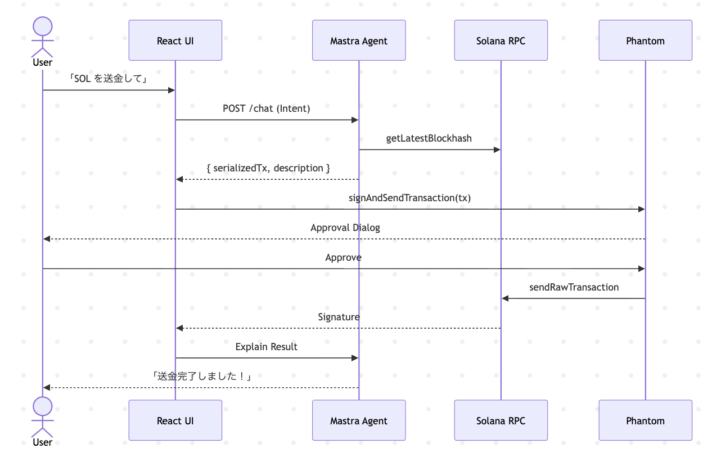
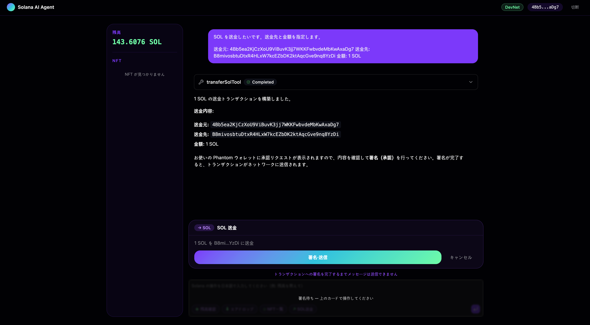
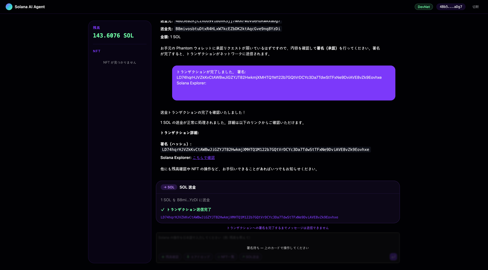

<!-- _class: title -->

# Building AI Agents on Solana
## Mastra Framework を活用した次世代エージェント開発

Solana Bootcamp 
2025.05.08

---

# Today's Roadmap

<div class="grid-2" style="grid-template-columns: repeat(3, 1fr);">
<div class="grid-item">
<span class="index">01</span>
<strong>The Solana Advantage</strong>
<span style="color: var(--muted);"><br/>AI エージェントへの最適性</span>
</div>
<div class="grid-item">
<span class="index">02</span>
<strong>Technical Stack</strong>
<span style="color: var(--muted);"><br/>最先端の技術選定</span>
</div>
<div class="grid-item">
<span class="index">03</span>
<strong>Core Building Blocks</strong>
<span style="color: var(--muted);"><br/>Skills と構成要素</span>
</div>
<div class="grid-item">
<span class="index">04</span>
<strong>Security Architecture</strong>
<span style="color: var(--muted);"><br/>Non-custodial 設計</span>
</div>
<div class="grid-item">
<span class="index">05</span>
<strong>System Integration</strong>
<span style="color: var(--muted);"><br/>AWS Cloud & IaC</span>
</div>
<div class="grid-item">
<span class="index">06</span>
<strong>Dev Workflow</strong>
<span style="color: var(--muted);"><br/>開発からデプロイまで</span>
</div>
</div>
<div class="grid-item" style="margin-top: 10px; text-align: center; border-left: 4px solid var(--accent-warm);">
<span class="index">07</span>
<strong>Future Outlook</strong><br/>オンチェーン UX の変革と次のステップ
</div>

---

<!-- _class: lead -->

# Solana<br/>The Ultimate Execution Layer

---

# Solana Enables Agentic Workflows

AI エージェントがオンチェーンで自律的に行動する際, Solana は最適な環境を提供します。

<div class="grid-2">
<div class="grid-item">
<span class="index">01</span>
<strong>Cost-Efficient</strong><br/>
頻繁な**マイクロトランザクション**向き
</div>
<div class="grid-item">
<span class="index">02</span>
<strong>Real-Time Speed</strong><br/>
意思決定を妨げない**高いスループット**。
</div>
<div class="grid-item">
<span class="index">03</span>
<strong>Rich Ecosystem</strong><br/>
**Jupiter** や **Metaplex** 等の便利なAPI
</div>
<div class="grid-item">
<span class="index">04</span>
<strong>Sovereign Identity</strong><br/>
エージェントが自ら**資産を管理**する基盤。
</div>
</div>

<div class="highlight">
  AI Agent = 24/7 稼働する「自律的なオンチェーン・プレイヤー」
</div>

---

<!-- _class: section -->

# Modern Technical Stack
### 2026 年の標準的なエージェント開発基盤

---

# Robust Tech Stack for Production Agents

最新のライブラリとフレームワークを組み合わせ, 安全かつ高速な開発を実現します。

<div class="grid-2">
<div class="grid-item">
<span class="index">Frontend</span>
<strong>React 19 + Vite 8</strong>
<ul style="font-size: 0.8em; margin: 4px 0;">
<li>TypeScript 6.x / Tailwind 4</li>
<li>shadcn/ui + Radix UI</li>
<li>Vercel AI SDK (Streaming)</li>
</ul>
</div>
<div class="grid-item">
<span class="index">AI / Agent</span>
<strong>Mastra 1.x</strong>
<ul style="font-size: 0.8em; margin: 4px 0;">
<li>Google Gemini (LLM)</li>
<li>LibSQL (Long-term Memory)</li>
<li>DuckDB (Observability)</li>
</ul>
</div>
<div class="grid-item">
<span class="index">Solana / Web3</span>
<strong>web3.js 1.x + Metaplex</strong>
<ul style="font-size: 0.8em; margin: 4px 0;">
<li>MPL Core / DAS API (NFTs)</li>
<li>Jupiter v6 API (Swap)</li>
<li>Wallet Adapter (Phantom)</li>
</ul>
</div>
<div class="grid-item">
<span class="index">Infra / Tooling</span>
<strong>AWS CDK + Bun</strong>
<ul style="font-size: 0.8em; margin: 4px 0;">
<li>Lambda (Container Runtime)</li>
<li>DynamoDB (Session Storage)</li>
<li>Biome (Lint/Format)</li>
</ul>
</div>
</div>

---

<!-- _class: section -->

# Mastra
### AI エージェント開発の複雑さを抽象化する

---

# Mastra 

Mastra は複雑な AI エージェントの開発を効率化するフレームワークです。

<div style="display: grid; grid-template-columns: 1fr 1fr; gap: 36px; align-items: start;">
<div>

### Key Features
- **Modular Skills**: <br/>チェーン操作を疎結合な部品として管理。
- **Stateful Threads**: <br/>会話の文脈を保持する**強力な記憶管理**。
- **Provider Agnostic**: <br/>Gemini や **Claude** 等を自在に選択。
- **Vector Memory**: <br/>**LibSQL** 連携による高速な知識検索。

</div>
</div>

---

# Mastra 

Mastra は複雑な AI エージェントの開発を効率化するフレームワークです。

<div style="display: grid; grid-template-columns: 1fr 1fr; gap: 36px; align-items: start;">

<div style="background: #0f172a; border: 1px solid var(--border); border-radius: 12px; padding: 16px 20px; border-left: 4px solid var(--accent);">

```typescript
import { Mastra } from '@mastra/core';

const mastra = new Mastra({
  agents: [solanaAgent],
  storage: new LibSQLStorage({
    url: 'file:mem.db'
  }),
  server: {
    apiRoutes: [
      chatRoute({
        path: "/chat/:agentId",
      }),
    ],
  },
  logger: logger,
  observability: observability
});
```

</div>
</div>

---

# Agent Skills 

Solana 操作を抽象化したツールをエージェントに持たせ, 機能を拡張します。

| Tool | Actionable Goal | Category |
| :--- | :--- | :--- |
| `getBalanceTool` | 💰 **残高確認**による正確な実行判断 | Info |
| `transferSolTool` | 💸 **SOL 送金**の自動構築 | Payment |
| `getNftsTool` | 🖼️ **保有 NFT** の Metaplex 取得 | Assets |
| `jupiterSwapTool` | 🔄 **Jupiter v6** 最適レート交換 | DeFi |
| `mintNftTool` | 🚀 **MPL Core** による高速 Mint | NFT |
| `airdropTool` | 🚰 **DevNet SOL** の自動供給 | Tool |

---

<!-- _class: section -->

# Non-Custodial Security Model
### ユーザーの資産を守る「署名委任」の設計

---

# Non-Custodial Flow 

AI エージェントが勝手に資金を動かさない **Safe Signing** プロセスを徹底します。

<div class="steps">
<div style="display: flex; align-items: flex-start; gap: 16px; margin: 10px 0;"><b>1. Intent Analysis</b>: "1 SOL を USDC にスワップして" と依頼。</div>
<div style="display: flex; align-items: flex-start; gap: 16px; margin: 10px 0;"><b>2. Unsigned TX Construction</b>: エージェントが <b>base64 形式の未署名 Tx</b> を構築。</div>
<div style="display: flex; align-items: flex-start; gap: 16px; margin: 10px 0;"><b>3. Frontend Handover</b>: React UI が Tx をデシリアライズし <b>Phantom</b> へ要求。</div>
<div style="display: flex; align-items: flex-start; gap: 16px; margin: 10px 0;"><b>4. Manual User Approval</b>: ユーザーが内容を目視確認し, <b>手動で署名・送信</b>。</div>
<div style="display: flex; align-items: flex-start; gap: 16px; margin: 10px 0;"><b>5. Follow-up Explanation</b>: 送信結果（Signature）をエージェントが解説。</div>
</div>

<div class="highlight">
サーバー側に秘密鍵を置かないため, ハッキングリスクを根本から排除します。
</div>

---

# Sequence: Safe Signing Interaction

<div style="text-align: center; margin-top: 10px; background: white; border-radius: 12px; padding: 16px;">



</div>

---



---



---

<!-- _class: section -->

# AWS Scalable Infrastructure
### IaC による堅牢なクラウドネイティブ構成

---

# Prioritizes Scalability and Safety

AWS のサーバーレス機能をフル活用し, 高い可用性とセキュリティを担保します。

<div>
<div>

### Core Infrastructure
- **API Gateway**: HTTP v2 による高速ルーティング。
- **AWS Lambda**: **Lambda Web Adapter** による Mastra 実行.
- **Amazon CloudFront**: SPA ホスティング & エッジ配信。
- **Amazon DynamoDB**: 会話履歴・セッションの永続化。
- **Secrets Manager**: API Key の安全な管理。

</div>
</div>

---

# Efficient Development & Deployment

Bun を核としたモダンな開発フローにより, デプロイ時間を短縮します。

<div style="display: grid; grid-template-columns: 1fr 1fr; gap: 36px;">
<div style="background: #0f172a; border: 1px solid var(--border); border-radius: 12px; padding: 16px 20px;">
<h3>Local Dev</h3>
<p><b>Bun + Vite</b> による超高速 HMR。</p>
<pre><code class="hljs-bash">bun run dev</code></pre>
</div>
<div style="background: #0f172a; border: 1px solid var(--border); border-radius: 12px; padding: 16px 20px;">
<h3>Cloud Deploy</h3>
<p><b>AWS CDK</b> による一括構築。</p>
<pre><code class="hljs-bash">bun run deploy '*'</code></pre>
</div>
</div>

---

<!-- _class: lead -->

# AI Agents will Revolutionize <br/>On-Chain UX
### 複雑なオンチェーン操作は「対話」へと集約される

---

# Building the Future of Finance

1. **Mastra Framework** は, AI とチェーンの架け橋を**標準化**する。
2. **Specialized Skills** を磨くことで, エージェントの価値が決定する。
3. **Safety-First** な設計が, マスアダプションへの唯一の道。

---

# Building the Future of Finance

### Start Your Journey Today
- **Mastra Docs** を読み, ボイラープレートを作成する。
- **Custom Skills** を実装し, 独自のロジックをエージェントに授ける。
- **Solana Ecosystem** へ, あなたのエージェントをデプロイしよう。

---

<!-- _class: ending -->

# Thank You!
## Happy Hacking on Solana!

Q&A / Feedback
GitHub: `solana-agent-repo`
