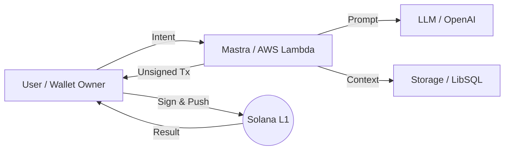

<!-- _class: title -->

# Building AI Agents on Solana
## Mastra Framework を活用した次世代エージェント開発

Solana Bootcamp 
2025.05.08

---

# Today's Roadmap

<div class="grid">
<div class="grid-item">
<span class="index">01</span>
<strong>The Solana Advantage</strong>
<span style="color: var(--muted);">AI エージェントへの最適性</span>
</div>
<div class="grid-item">
<span class="index">02</span>
<strong>Framework Overview</strong>
<span style="color: var(--muted);">Mastra の標準化体験</span>
</div>
<div class="grid-item">
<span class="index">03</span>
<strong>Core Building Blocks</strong>
<span style="color: var(--muted);">Skills と構成要素</span>
</div>
<div class="grid-item">
<span class="index">04</span>
<strong>Reliable Architecture</strong>
<span style="color: var(--muted);">安全なシステム設計</span>
</div>
<div class="grid-item">
<span class="index">05</span>
<strong>Execution Lifecycle</strong>
<span style="color: var(--muted);">インテントから実行へ</span>
</div>
<div class="grid-item">
<span class="index">06</span>
<strong>Deployment & Security</strong>
<span style="color: var(--muted);">Non-custodial 運用</span>
</div>
<div class="grid-item" style="grid-column: span 3; text-align: center; border-left: 4px solid var(--accent-warm);">
<span class="index">07</span>
<strong>Future Outlook</strong> — オンチェーン UX の変革と次のステップ
</div>
</div>

---

<!-- _class: lead -->

# Solana: The Ultimate Execution Layer for AI
### 高速な基盤が AI の「実行力」を最大化する

---

# Solana Enables Autonomous Agentic Workflows

AI エージェントがオンチェーンで自律的に行動する際, Solana は最適な環境を提供します。

<div class="columns">
<div>

- **Cost-Efficient**: 頻繁な**マイクロトランザクション**を許容する低価格。
- **Real-Time Speed**: 意思決定を妨げない**高いスループット**。
- **Rich Ecosystem**: **Jupiter** や **Metaplex** 等の強力な道具。
- **Sovereign Identity**: エージェントが自ら**資産を管理**する基盤。

</div>
<div class="card accent">
<div style="font-size: 0.9em;">
AI の「思考（LLM）」と Solana の「実行（On-chain）」が融合し, 人間を介さない経済活動が現実のものになります。
</div>
</div>
</div>

<div class="highlight">
  AI Agent = 24/7 稼働する「自律的なオンチェーン・プレイヤー」
</div>

---

<!-- _class: section -->

# Mastra: Standardizing Agentic Development
### AI エージェント開発の複雑さを抽象化する

---

# Mastra Streamlines Complex Agent Workflows

Mastra は, 複雑な AI エージェントのロジックを整理し, 開発を効率化するフレームワークです。

<div class="columns">
<div>

### Key Features
- **Modular Skills**: チェーン操作を疎結合な部品として管理。
- **Stateful Threads**: 会話の文脈を保持する**強力な記憶管理**。
- **Provider Agnostic**: OpenAI や **Claude 3.5** 等を自在に選択。
- **Vector Memory**: **LibSQL** 連携による高速な知識検索。

</div>
<div class="card accent">

```typescript
import { Mastra } from '@mastra/core';

const mastra = new Mastra({
  agents: [solanaAgent],
  storage: new LibSQLStorage({
    url: 'file:mem.db'
  }),
});
```

</div>
</div>

---

# Defining a Purpose-Built Solana AI Agent

Mastra を用いて, Solana に特化した専門性を持つエージェントを構成します。

<div class="columns">
<div class="card">
<h3>Identity</h3>
<p>「Solana 専門家」としての<b>ペルソナ</b>。適切な語り口と推論ルールを定義。</p>
</div>
<div class="card">
<h3>Skills</h3>
<p>エージェントが「手」として使う<b>ツール群</b>。Jupiter SDK 等をラップ。</p>
</div>
</div>

<div class="columns" style="margin-top: 10px;">
<div class="card">
<h3>Model</h3>
<p><b>GPT-4o / Sonnet 3.5</b>。複雑な命令を分解し, ツールの利用を判断。</p>
</div>
<div class="card">
<h3>Memory</h3>
<p>ユーザーの過去の嗜好や<b>過去の取引履歴</b>を学習し, 最適化。</p>
</div>
</div>

---

# Specialized Skills Act as the Agent's Hands

Solana 操作を抽象化したツールをエージェントに持たせ, 機能を拡張します。

| Tool | Actionable Goal |
| :--- | :--- |
| `getBalanceTool` | 💰 **残高確認**による正確な実行判断 |
| `transferSolTool` | 💸 簡単な**送金・決済**の自動化 |
| `getNftsTool` | 🖼️ **保有資産**に応じたパーソナライズ |
| `jupiterSwapTool` | 🔄 最適レートでの**DeFi 操作**実行 |
| `mintNftTool` | 🚀 新しい**デジタル資産**の生成 |

<div class="highlight" style="font-size: 0.9em;">
※ <strong>Non-custodial</strong> 原則：エージェントは署名せず, 提案のみを行う。
</div>

---

<!-- _class: section -->

# Secure and Scalable Architecture
### 堅牢なインフラと安全なユーザー体験の両立

---

# Architecture Prioritizes Scalability and Safety

<div style="text-align: center; margin-top: 10px;">



</div>

<div class="columns" style="margin-top: 20px;">
<div class="card accent">
<strong>Backend Control</strong>: Mastra が LLM と連携し, 最適な<b>オンチェーン計画</b>を立案。
</div>
<div class="card accent">
<strong>Frontend Security</strong>: ユーザーが最終的な<b>署名権限</b>を保持し, 安全性を担保。
</div>
</div>

---

# Non-Custodial Flow Guarantees User Security

AI エージェントが勝手に資金を動かさない **Safe Signing** プロセスを徹底します。

<div class="steps">

<div class="step">
<b>Natural Language Input</b>: "1 SOL を USDC にスワップして" と依頼。
</div>

<div class="step">
<b>Transaction Planning</b>: エージェントが Jupiter から<b>未署名 Tx</b> を生成。
</div>

<div class="step">
<b>Payload Delivery</b>: フロントエンドが Tx データを<b>Phantom</b> へ転送。
</div>

<div class="step">
<b>Final User Approval</b>: ユーザーが内容を目視確認し, <b>手動で署名</b>。
</div>

</div>

<div class="highlight">
サーバー側に秘密鍵を置かないため, ハッキングリスクを最小化可能。
</div>

---

<!-- _class: dark -->

# Seamless Intent-to-Action Execution Flow

エージェントがアクション（ツール実行結果）を返す際のデータ構造例。

```typescript
// エージェントのレスポンス：実行準備完了を通知
{
  "message": "1 SOL を USDC にスワップする準備ができました。",
  "action": {
    "type": "TRANSACTION",
    "data": "Base64EncodedTxData...", // 未署名トランザクション
    "tool": "jupiterSwapTool",
    "explanation": "現在の最良レート 180.5 USDC でのスワップです"
  }
}
```

<div class="card" style="color: #e2e8f0;">
ユーザーは「複雑な DeFi 手順」を<b>「自然言語による承認」</b>のみで完結できます。
</div>

---

# Mastra is Ready for Multi-Cloud Deployment

スケーラビリティとコスト効率を最大化するデプロイメント。

<div class="columns">
<div>

- **AWS Lambda (CDK)**
  - **コスト効率**に優れたサーバーレス実行。
  - プロジェクト全体の**IaC 化**が容易。
- **Turso (LibSQL)**
  - **エッジデータベース**で低遅延。
  - エージェントの「記憶」を高速に同期。

</div>
<div>

- **Vercel Edge**
  - **グローバル配信**で低レイテンシ。
  - フロントエンドとの親和性が抜群。
- **Streaming Response**
  - ユーザーを待たせない**リアルタイム応答**。

</div>
</div>

<div class="highlight">
<strong>Mastra + Lambda + Turso</strong> = 2025 年の標準的なエージェント構成。
</div>

---

# Security and UX: The Core Pillars

開発・運用において「妥協してはいけない」重要項目。

<div class="columns">
<div class="card">
<h3>Security</h3>
<ul style="font-size: 0.9em;">
<li><b>Non-custodial</b> 設計の徹底。</li>
<li>エージェント側で<b>秘密鍵を一切保持・閲覧しない</b>分離。</li>
<li><b>Prompt Injection</b> 対策の実施。</li>
</ul>
</div>
<div class="card">
<h3>UX / Interaction</h3>
<ul style="font-size: 0.9em;">
<li>処理中の<b>視覚的フィードバック</b>。</li>
<li>失敗時の<b>明確なエラー提示</b>。</li>
<li><b>確認画面</b>での透明性確保。</li>
</ul>
</div>
</div>

<div class="card accent" style="text-align: center;">
<b>"Reliability over Autonomy"</b> — 自律性よりも, ユーザーの信頼を優先する。
</div>

---

<!-- _class: lead -->

# AI Agents will Revolutionize On-Chain UX
### 複雑な Web3 操作は「対話」へと集約される

---

# Building the Future of Autonomous Finance

1. **Mastra Framework** は, AI とチェーンの架け橋を**標準化**する。
2. **Specialized Skills** を磨くことで, エージェントの価値が決定する。
3. **Safety-First** な設計が, マスアダプションへの唯一の道。

### Start Your Journey Today
- **Mastra Docs** を読み, ボイラープレートを作成する。
- **Custom Skills** を実装し, 独自のロジックをエージェントに授ける。
- **Solana Ecosystem** へ, あなたのエージェントをデプロイしよう。

---

<!-- _class: ending -->

# Thank You!
## Happy Hacking on Solana!

Q&A / Feedback
GitHub: `solana-agent-repo`